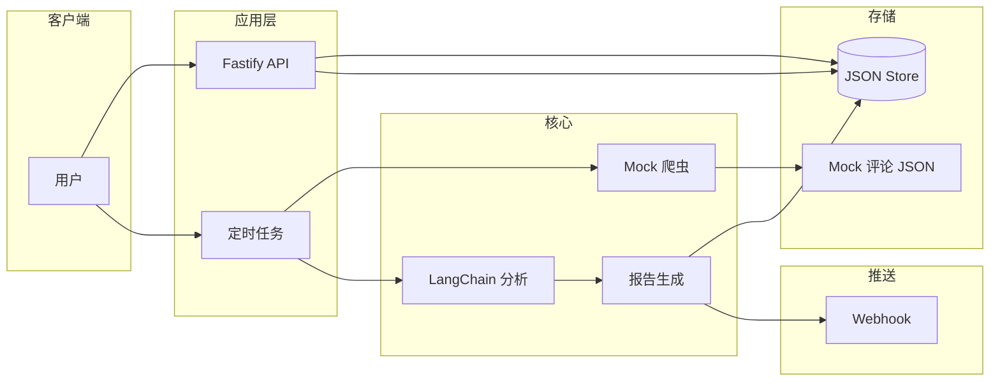
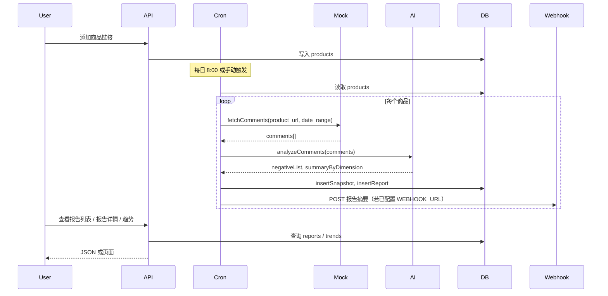

# 电商负面评论监测 AI 应用 - 设计文档

## 1. 整体架构



- **用户**：通过 Web 页面添加监测商品、触发监测、查看报告与趋势。
- **Fastify API**：提供商品 CRUD、报告列表/详情、趋势、触发监测接口。
- **定时任务**：每日 8:00 对已登记商品执行拉取 → 分析 → 写报告。
- **Mock 爬虫**：从本地 `data/mockComments.json` 按 `product_url`/`date_range` 返回评论，无需真实爬虫。
- **LangChain 分析**：对评论做情感分析（正面/负面/中性）与问题维度提取（质量、服务、物流、价格）。
- **报告生成**：组装负面摘要、维度分布、可读报告内容写入 DB。
- **JSON 文件存储**：以 `data/products.json`、`data/snapshots.json`、`data/reports.json` 持久化商品、评论快照、报告，支持趋势查询。

## 2. 数据流程



- **录入**：用户添加商品 URL → 写入 `products`。
- **每日拉取**：定时或手动触发 → 对每个商品调用 Mock 接口拿评论 → 调用 AI 分析 → 写入 `comment_snapshots` 与 `reports`。
- **查看**：报告列表、报告详情、趋势均从 DB 查询返回。

## 3. AI 分析逻辑

### 3.1 输入与输出

- **输入**：一批电商评论（每条含 `comment_id, user_name, rating, comment_text, comment_time, helpful_count`），单次最多 50 条。
- **输出**：
  - `negativeList`：被判定为「负面」的评论列表，并附带维度（质量/服务/物流/价格）与关键词。
  - `summaryByDimension`：各维度的负面数量统计，供报告概览与趋势使用。

### 3.2 Prompt 设计

- **系统 Prompt**：定义角色为电商评论分析助手；明确情感三分类（正面/负面/中性）及四个问题维度（质量、服务、物流、价格）的含义与判定标准。
- **用户 Prompt**：传入评论列表（带序号与评分），要求模型按固定 JSON 结构输出：
  - `items[]`：每条评论的 `sentiment`、`dimensions`、`keywords`。
  - `summary`：`negative_count`、`by_dimension` 各维度数量。

### 3.3 情感与维度判定规则

- **情感**：以用户表达的不满/满意倾向为主；评分 1–2 多为负面参考，但不唯一依据，以评论文本为准。
- **维度**：仅对负面评论标注维度；一条评论可属多个维度（如既抱怨质量又抱怨物流）。

实现位置：`src/ai/prompts.ts`（模板）、`src/ai/analyzer.ts`（调用 LangChain ChatOpenAI、解析 JSON）。

## 4. 数据库设计

### 4.1 表结构

| 表名 | 说明 |
|------|------|
| products | 监测商品 |
| comment_snapshots | 某次拉取的评论快照 |
| reports | 监测报告 |

### 4.2 products

| 字段 | 类型 | 说明 |
|------|------|------|
| id | INTEGER PK | 自增主键 |
| product_url | TEXT UNIQUE | 商品链接 |
| name | TEXT | 可选名称 |
| created_at | TEXT | 创建时间 |

### 4.3 comment_snapshots

| 字段 | 类型 | 说明 |
|------|------|------|
| id | INTEGER PK | 自增主键 |
| product_id | INTEGER FK | 关联 products.id |
| date_range_start | TEXT | 统计开始日期 |
| date_range_end | TEXT | 统计结束日期 |
| comment_count | INTEGER | 评论条数 |
| raw_json | TEXT | 原始评论 JSON（可选） |
| created_at | TEXT | 创建时间 |

### 4.4 reports

| 字段 | 类型 | 说明 |
|------|------|------|
| id | INTEGER PK | 自增主键 |
| product_id | INTEGER FK | 关联 products.id |
| snapshot_id | INTEGER FK | 关联 comment_snapshots.id（可选） |
| report_date | TEXT | 报告日期 |
| negative_count | INTEGER | 负面评论数 |
| negative_summary | TEXT | 负面摘要文案 |
| dimension_summary | TEXT | 维度统计 JSON |
| content | TEXT | 完整报告内容（Markdown 等） |
| created_at | TEXT | 创建时间 |

### 4.5 关系与索引

- `comment_snapshots.product_id` → `products.id`
- `reports.product_id` → `products.id`，`reports.snapshot_id` → `comment_snapshots.id`
- 索引：`comment_snapshots(product_id)`、`reports(product_id)`、`reports(report_date)`，便于列表与趋势查询。

---

## 5. 报告推送

每次报告生成后，系统支持通过 **Webhook** 主动将报告摘要推送给客户：

- 在 `.env` 中配置 `WEBHOOK_URL`（如 `https://your-server.com/webhook/report`），系统会在 `jobs/dailyMonitor.ts` 中 `persistMonitorResult()` 之后自动向该地址发送 HTTP POST，携带以下 JSON 字段：

```json
{
  "event": "report_created",
  "productId": 1,
  "productName": "商品名称",
  "productUrl": "https://...",
  "reportId": 10,
  "reportDate": "2024-12-01",
  "negativeCount": 5,
  "totalComments": 120
}
```

- 若 `WEBHOOK_URL` 未配置或为空，推送自动跳过，不影响正常流程。
- Webhook 推送失败仅打印日志，不阻断监测流程。

**扩展**：如需邮件推送，可在 `sendWebhookNotification()` 同级位置增加邮件发送逻辑，配置项放在环境变量中。
